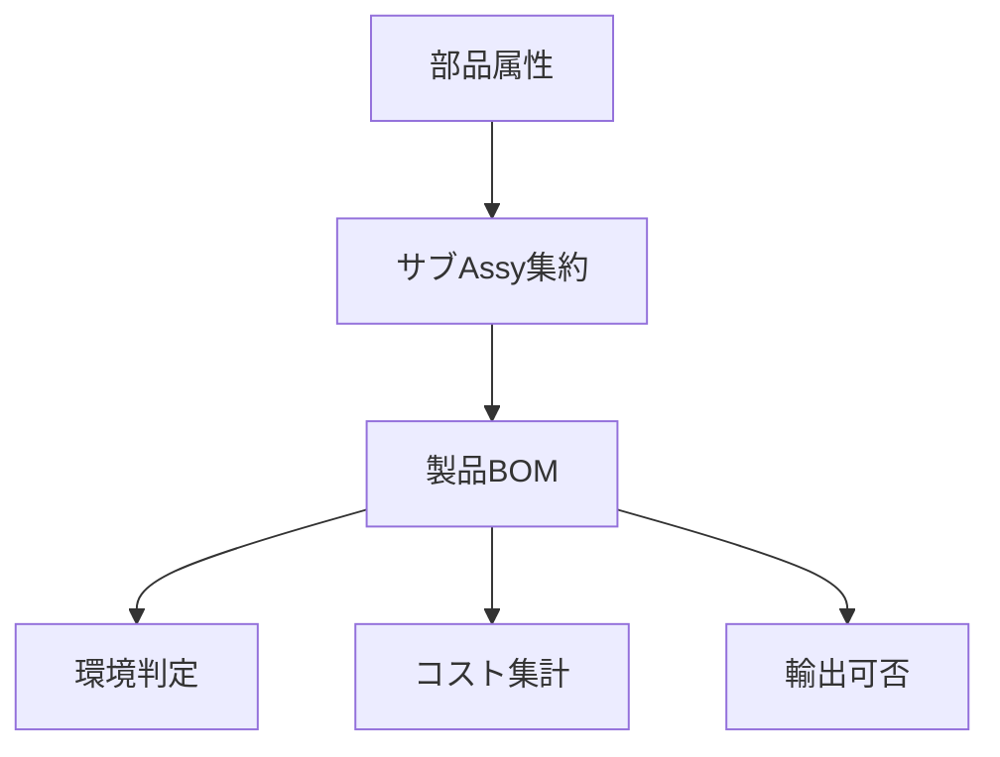

# 📊 積み上げ管理 | Roll-up Management

- **環境**: 部品 → Assy → 製品判定  
- **コスト**: 部品 → サブAssy → 製品原価  
- **輸出**: 部品該非 → 製品輸出可否  

```mermaid
flowchart TD
  A[部品属性] --> B[サブAssy集約]
  B --> C[製品BOM]
  C --> D[環境判定]
  C --> E[コスト集計]
  C --> F[輸出可否]
```
