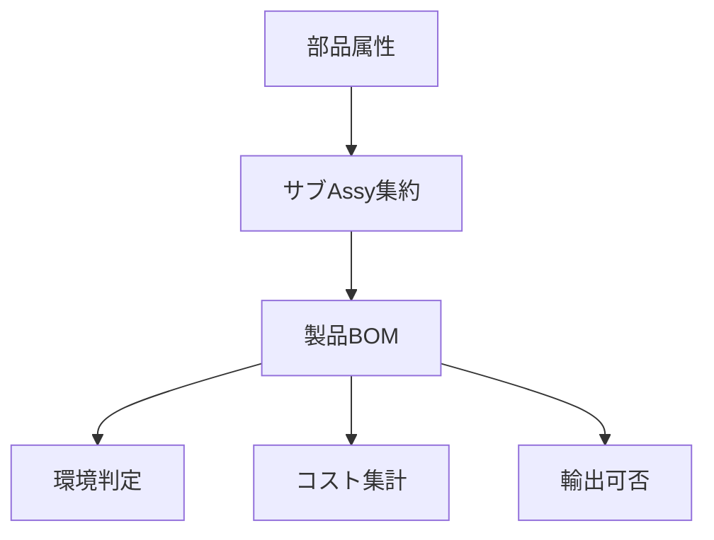

# 📊 積み上げ管理 | Roll-up Management

## 基本概念

BOMは単なる「部品リスト」ではなく、  
**部品ごとの属性情報を集約し、製品全体の評価を行う仕組み** です。  

- **環境管理（例: RoHS/REACH）**  
  部品ごとの環境データ（含有化学物質）を積み上げ、製品レベルで「規制クリア／NG」を判定する。  

- **コスト管理**  
  部品単価・加工費・材料費を積み上げ、サブアセンブリごとのコストを算出。  
  さらに集約して製品の製造原価を求める。  

- **輸出管理**  
  各部品の該非判定やHSコードを積み上げ、製品として輸出可能かどうかを判断。  

---

## 🔗 積み上げフロー

- **A: 部品属性**  
  図面、環境データ、コスト、該非判定などを部品レベルで定義。  

- **B: サブAssy集約**  
  サブアセンブリ単位で情報をまとめる。  
  （例: 基板Assy、筐体Assy）  

- **C: 製品BOM**  
  全サブAssyを統合した構成情報。  

- **D: 環境判定**  
  「この製品はRoHS準拠か？」「特定化学物質を含むか？」を製品単位で確認。  

- **E: コスト集計**  
  各部品・Assyの原価を集計し、製品全体の原価を算出。  

- **F: 輸出可否**  
  部品ごとの該非判定やHSコードを反映し、製品の輸出条件を確定。  

---

## 💡 ポイント

1. **積み上げは属性ごとに独立して行える**  
   - 環境データ、コスト、輸出可否を並列に評価可能。  

2. **最小単位の正確性が重要**  
   - 部品レベルで誤りがあると、製品全体の判定に影響。  

3. **更新管理が必須**  
   - 部品の仕様変更（材料変更、価格改定、該非判定更新）は、必ず積み上げ結果を再評価する必要がある。  

👉 積み上げ管理は「見える化」と「判断の自動化」の基盤。  
企業内システム（PLM/ERP）に直結させると効果が高い。  
