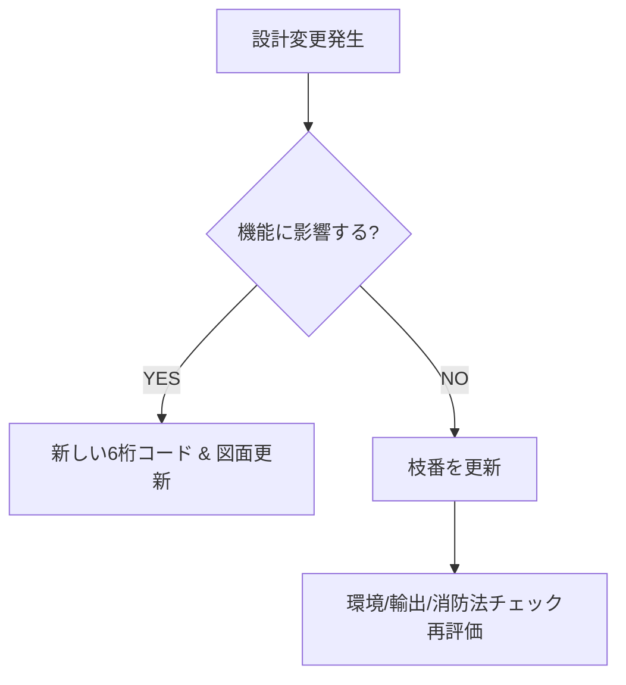

# ⚖️ 運用ルール | Rules

## 設計変更時の判断

- **機能変化なし → 枝番更新**  
  （例: メッキ厚の変更、寸法公差微修正）  

- **機能変化あり → 新しい6桁コード**  
  （例: 構造変更、仕様変更により互換性がなくなる場合）  

- **材料コード（6番）の場合**  
  - **SDS（安全データシート）必須**  
  - **消防法判定必須**（危険物区分、指定数量、保管条件）  

---

## 4M変更とコード運用

- **コード変更なし**  
  - 機能は変わらないが、**製造装置や工程条件の変更**  
  - 作業指示や製造記録で管理可能  

- **枝番バージョンアップ**  
  - 部品機能は変わらないが、**表面処理や材質条件の変更**  
  - 例: メッキ厚の変更  

- **6桁コード変更**  
  - 機能そのものが変わる場合  
  - 新規図面とセットで新コードを発行  

---

## 💡 ポイント

- **6桁コードは機能を規定する識別子**  
  → 互換性がなくなる変更は必ず新コードに切替える。  
- **枝番はトレーサビリティと改版管理**  
  → 軽微な変更や製造条件差異を管理。  
- **材料系は特別扱い**  
  → 環境規制、輸出規制、消防法対応のため、SDSと判定を必須とする。  

