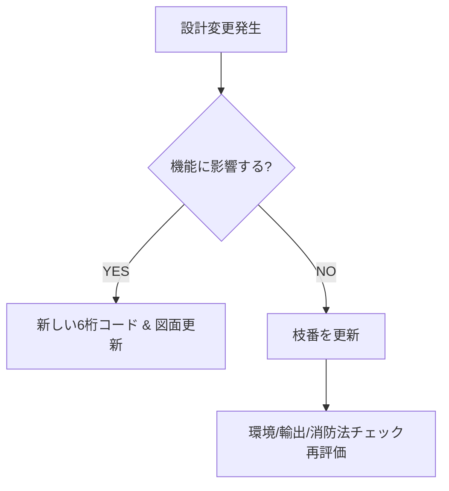

# ⚖️ 運用ルール | Rules

## 設計変更時の判断

```mermaid
flowchart TD
  A[設計変更発生] --> B{機能に影響する?}
  B -- YES --> C[新しい6桁コード & 図面更新]
  B -- NO --> D[枝番を更新]
  D --> E[環境/輸出/消防法チェック再評価]
```

•	機能変化なし → 枝番更新
	•	機能変化あり → 新しい6桁コード
	•	材料6番は SDS 必須・消防法判定必須
