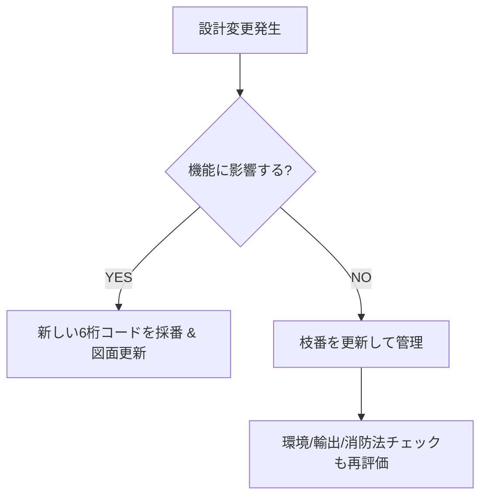

# 06_bom_generation

**部品表（BOM）の作成と設計情報の構造化**  
**Bill of Materials (BOM) Generation and Structured Design Data**

---

## 📑 目次 | Table of Contents

1. [📘 概要 | Overview](1_overview.md)  
2. [🔢 部品コード体系 | Part Numbering System](2_part_numbering.md)  
3. [📎 属性と輸出管理 | Attributes & Export Control](3_attributes.md)  
4. [📊 積み上げ管理 | Roll-up Management](4_rollup_management.md)  
5. [⚖️ 運用ルール | Rules](5_rules.md)  
6. [🧪 演習課題 | Exercises](6_exercises.md)  

---

## 📘 概要 | Overview

部品コード（6桁＋枝番）は **決まったルールに基づいて体系的に管理**されています。  
コードを見れば大カテゴリ（機械・電子・材料・治具）、条件差（金型・製造地・改版）、  
さらに安全規制や輸出対応の要否まで追跡できます。  

このセクションでは、設計構成に基づいた**部品表（BOM: Bill of Materials）**を作成し、  
量産や在庫管理に必要な構成情報を整理します。  
BOMは単なる部品リストではなく、**設計〜調達〜生産〜輸出までをつなぐ共通言語**です。  

---

## 🧑‍🏫 学習目標 | Learning Objectives

- 部品コードのルール（6桁＋枝番）を理解する  
- 組立構造に対応した部品階層と親子関係を整理する  
- 図面・環境・コスト・輸出判定を部品コードに紐づける  
- 積み上げ管理（コスト・環境・輸出可否）の考え方を学ぶ  
- 危険物（材料6番コード）の特別管理を理解する  

---

## 🔢 部品コード体系 | Part Numbering System

### 基本構造
```
ABCDEF-XX
```
- **ABCDEF（6桁）**：部品アイデンティティ  
- **-XX（枝番）**：条件差・改訂履歴  

### 第1桁カテゴリ（確定版）
| 1桁目 | 意味       | 例 |
|-------|------------|----|
| 1     | 機械部品   | ネジ、ギア、ベアリング |
| 2     | 電子部品   | 抵抗、コンデンサ、IC |
| 6     | 材料       | 鋼材、樹脂ペレット、溶剤（危険物） |
| 9     | 治具・工具 | 組立治具、検査治具 |

### 枝番ルール
- `-01, -02` → バージョン（機能変化なし、例：めっき厚変更）  
- `-11, -21` → 金型違い  
- `-51, -52` → 製造地違い（JP, CN, VNなど）  
- `-99` → 暫定・特採  

👉 **機能が変わる場合は新しい6桁コードを発行**  

---

## 📎 部品コードとセットで管理する情報

| 区分         | 内容例                                     |
|--------------|--------------------------------------------|
| 図面         | 2D/3D CAD、図面番号、Rev管理               |
| 環境データ   | RoHS/REACH適合、LCAデータ、リサイクル率     |
| コスト       | 単価、加工費、歩留まり補正後の原価         |
| 該非判定     | 輸出管理：該当/非該当、ECCN                |
| HSコード     | 輸出入分類番号（6〜9桁）                   |
| 用途説明書   | デュアルユース部品で輸出時に必要           |
| 消防法情報   | 類・項、指定数量、保管条件（SDS根拠）      |

---

## 📊 積み上げ管理 | Roll-up Management

- **環境データ**：EChem（含有物質） → Assy → 製品判定  
- **コスト**：部品単価 → サブAssy → 製品原価  
- **輸出**：部品該非 → 製品輸出可否 → 用途説明書添付  

👉 環境・コスト・輸出を「積み上げ式」で共通ロジックに統合  

---

## ⚖️ 運用ルールと判断基準



- 機能変化なし → 枝番更新  
- 機能変化あり → 新しい6桁コード  
- 材料コード6番はSDS必須、消防法判定を登録  

---

## 🧪 演習課題 | Exercises

1. 図面から部品コード（6桁＋枝番）を割り当てる  
2. 部品ごとに環境・コスト・該非・消防法を入力し、BOMを完成させる  
3. サブAssy積み上げで「製品原価」「輸出可否」「危険物届出要否」を判定  

---

## 📂 サブディレクトリ構成 | Subdirectories

```text
06_bom_generation/
├── 1_overview.md
├── 2_part_numbering.md
├── 3_attributes.md
├── 4_rollup_management.md
├── 5_rules.md
├── 6_exercises.md
├── bom_templates/          
├── sample_boms/            
├── attribute_definitions/  
└── bom_checklist/          
```
本ディレクトリは、部品表（BOM）の作成と設計情報の構造化を扱います。  
各章に分割して詳細を記載しています。

## 📂 構成
- [1_overview.md](1_overview.md) – 概要・学習目標
- [2_part_numbering.md](2_part_numbering.md) – 部品コード体系
- [3_attributes.md](3_attributes.md) – 属性（図面・環境・コスト・輸出）
- [4_rollup_management.md](4_rollup_management.md) – 積み上げ管理
- [5_rules.md](5_rules.md) – 運用ルール
- [6_exercises.md](6_exercises.md) – 演習課題
  
---

## 💬 コメント・共有 | Feedback

BOMの実務的な工夫、部品コードの運用例、該非判定・消防法対応などについてぜひ共有ください。  
[Discussions](https://github.com/Samizo-AITL/EduMecha/discussions) にて議論可能です。  

---

💡 このREADMEで伝えたい一番大事なこと：  
**「部品コードはルールに基づいて管理されており、設計〜輸出までを一貫してつなぐ共通言語である」**
