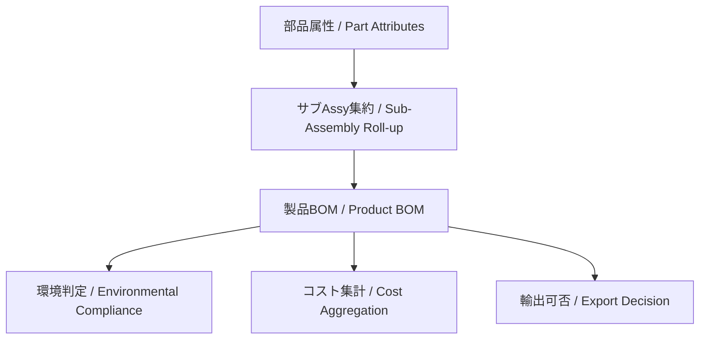

---

# 📊 積み上げ管理 | Roll-up Management

---

## 基本概念 | Basic Concept

| 観点 / Aspect | 内容（日本語） | Content (English) |
|---------------|----------------|-------------------|
| 環境管理 | 部品ごとの環境データ（含有化学物質）を積み上げ、製品レベルで「規制クリア／NG」を判定する。 | Aggregate environmental data (e.g., hazardous substances) at part level and judge compliance (RoHS/REACH) at product level. |
| コスト管理 | 部品単価・加工費・材料費を積み上げ、サブAssyごとにコストを算出し、製造原価を求める。 | Roll up unit price, processing, and material costs to calculate sub-assembly and total manufacturing cost. |
| 輸出管理 | 各部品の該非判定やHSコードを積み上げ、製品全体の輸出可否を判断。 | Accumulate export classifications (ECCN/HS codes) to decide product-level exportability. |

---

## 🔗 積み上げフロー | Roll-up Flow

| ステップ / Step | 日本語 | English |
|----------------|--------|---------|
| A: 部品属性 | 図面、環境データ、コスト、該非判定を部品レベルで定義 | Define drawings, environmental data, cost, and export classification at part level |
| B: サブAssy集約 | サブアセンブリ単位で情報をまとめる（例: 基板Assy、筐体Assy） | Aggregate information by sub-assembly (e.g., PCB Assy, chassis Assy) |
| C: 製品BOM | 全サブAssyを統合した構成情報 | Integrated BOM for the full product |
| D: 環境判定 | RoHS/REACH準拠や特定物質の有無を製品単位で確認 | Verify RoHS/REACH compliance at product level |
| E: コスト集計 | 部品・Assy原価を積算し、製品全体の製造原価を算出 | Aggregate costs to calculate total product cost |
| F: 輸出可否 | 各部品の該非判定・HSコードを反映し、製品輸出条件を確定 | Reflect part-level ECCN/HS code to finalize export condition |

---

## 💡 ポイント | Key Takeaways

| ポイント / Point | 日本語 | English |
|------------------|--------|---------|
| 属性ごとに独立 | 環境・コスト・輸出を並列に評価可能 | Each attribute (environment, cost, export) can be evaluated independently |
| 部品レベルの正確性 | 最小単位で誤りがあると製品全体の判定に影響 | Accuracy at part level is crucial; errors propagate to the whole product |
| 更新管理の必須性 | 部品仕様変更（材料変更、価格改定、該非判定更新）は積み上げを再評価 | Updates (material, price, classification) require re-evaluation of roll-up |

👉 積み上げ管理は **見える化** と **判断の自動化** の基盤。  
👉 *Roll-up management enables **visualization** and **automation of decisions**, especially when integrated into PLM/ERP systems.*  

---

[🔝 08_production_process/06_bom_generation に戻る ](./)

