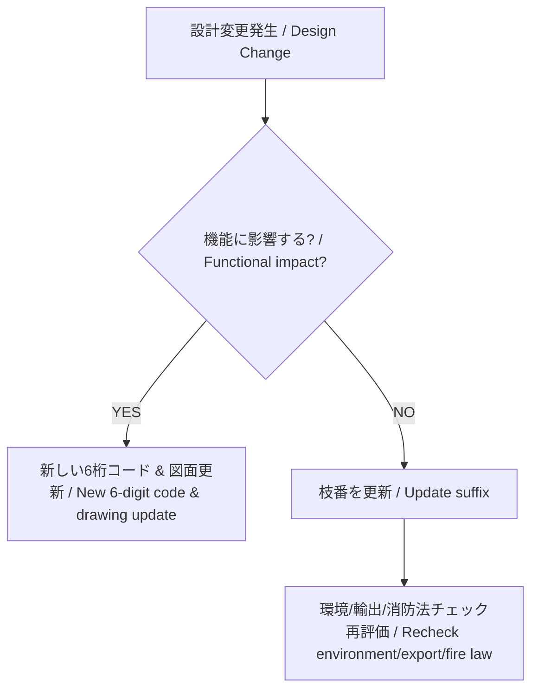

---

# ⚖️ 運用ルール | Rules

---

## 設計変更時の判断 | Design Change Decision

| **条件 / Condition** | **日本語 / Japanese** | **English** |
|-----------------------|------------------------|-------------|
| 機能変化なし | 枝番更新（例: メッキ厚の変更、寸法公差微修正） | Update suffix (e.g., plating thickness, tolerance adjustment) |
| 機能変化あり | 新しい6桁コード発行（例: 構造変更、仕様変更で互換性なし） | Issue new 6-digit code (e.g., structural/spec changes without compatibility) |
| 材料コード（6番） | SDS必須、消防法判定必須（危険物区分、指定数量、保管条件） | SDS required, Fire Law judgment mandatory (hazard category, quantity, storage conditions) |

---

## 4M変更とコード運用 | 4M Changes and Code Management

| **区分 / Category** | **日本語 / Japanese** | **English** |
|----------------------|------------------------|-------------|
| コード変更なし | 機能変わらず、製造装置・工程条件のみ変更。作業指示や製造記録で管理可能。 | No code change: Function unchanged, only process/equipment modified. Managed by work instructions/records. |
| 枝番バージョンアップ | 機能変わらず、表面処理や材質条件が変更（例: メッキ厚変更） | Suffix version update: Function unchanged, surface/material change (e.g., plating thickness). |
| 6桁コード変更 | 機能が変化する場合。新規図面とセットで新コードを発行。 | 6-digit code change: Function changes, new code with updated drawing. |

---

## 💡 ポイント | Key Points

- **6桁コード = 機能識別子 / 6-digit code = Functional identifier**  
  → 互換性がなくなる変更は必ず新コードに切替える。  
  → Always issue new code if compatibility is lost.  

- **枝番 = トレーサビリティ / Suffix = Traceability**  
  → 軽微な変更や製造条件差異を管理。  
  → Manages minor changes and manufacturing condition differences.  

- **材料コードは特別扱い / Materials are special cases**  
  → SDSと環境・輸出・消防法判定が必須。  
  → SDS, environmental/export/fire law compliance are mandatory.

---

[🔝 08_production_process/06_bom_generation に戻る ](./)

