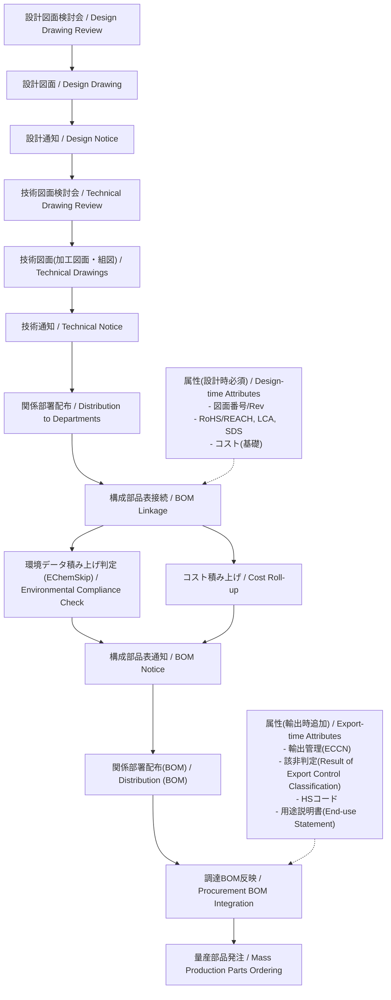

---

# 🏭 設計から量産部品発注までの実務フロー  
**Practical Workflow: From Design to Mass Production Parts Ordering**

---

## 📘 概要 | Overview
本資料は、設計段階から量産部品発注に至るまでの社内実務フローを整理したものです。  
「設計図面検討会」「技術図面検討会」「通知・配布」「BOM連携」「量産部品発注」までを体系的に示します。  

---

## 🔁 実務ワークフロー | Practical Workflow

---

## 📂 プロセス説明 | Process Description

- **設計図面検討会 → 設計図面**  
  設計意図・仕様をレビューし、正式な設計図面を確定。  

- **設計通知 → 技術図面検討会**  
  設計図面を通知した上で、加工図面や組立図面に展開。  

- **技術通知 → 関係部署配布**  
  加工・組立・品質保証・SCM部門に技術情報を共有。  

- **構成部品表接続 → 技術通知更新 → 部署配布**  
  BOMに反映し、関連部門へ再度通知・配布。  

- **調達BOM反映 → 量産部品発注**  
  調達部門が量産用のBOMを基に、部品をサプライヤへ発注。  

---

## 👤 著作・ライセンス | Author & License
- ✍️ 著作 / Author: **三溝真一（Samizo-AITL）**  
- 📜 ライセンス / License: **MIT**（教育目的での使用・改変を歓迎）  
